[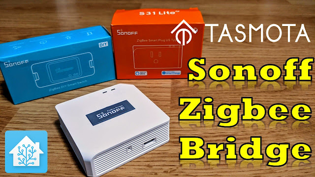](https://1.bp.blogspot.com/-2wSJjBZgxtg/Xxx8pApVDOI/AAAAAAAEcAY/lVaE6Kn4Qs8l10h4TGmaDTe3t-1nueoUwCLcBGAsYHQ/s1280/zigbee_title1.jpg)

  

Check out these two videos we did on Zigbee fundamentals - [Video #1](https://youtu.be/cWSIFgFQMw0) - [Video #2](https://youtu.be/HVq4tT6g41U) 

  

I reviewed the [Sonoff Zigbee Bridge](https://shrsl.com/39qod) a few months ago in a [video](https://youtu.be/fZEsVl-zQ9I) and was excited to see it had an ESP82xx chipset onboard.  This meant there was a glimmer of hope it could be flashed with open source local control firmware such as [Tasmota](https://tasmota.github.io/docs/)!  That time has come!  The genius developers with Tasmota have done their magic again.  An inexpensive device you can add to Home Assistant as a Zigbee controller.  No YAML, no custom plugins, no MQTT.  One of the major advantages is being able to place it closer to your Zigbee devices which is especially helpful if you have your Home Assistant box in the basement or buried back in some closet.  Behold the ZHA Integration below.

  

UPDATE March 2021:  iTead also is now selling their [USB 3.0 dongle](https://shrsl.com/2ur07) that uses the same chip as the Zigbee Bridge.  It is preflashed with correct firmware out of the box that can also be used with ZHA and Zigbee2MQTT using the same procedure as below with the USB port. See more here in this article for Z2M usage [https://www.digiblur.com/2021/03/zigbee2mqtt-with-sonoff-zigbee-bridge.html](https://www.digiblur.com/2021/03/zigbee2mqtt-with-sonoff-zigbee-bridge.html)

  

**Purchase Sonoff Zigbee Bridge:**

[Pre-Flashed with Tasmota - SKIP this Guide (Ebay)](https://ebay.us/yoqyCZ)

[Pre-Flashed with Tasmota from Cloudfree - SKIP this Guide](https://cloudfree.shop/product/sonoff-zigbee-bridge-flashed-with-tasmota/?ref=digiblur)

[Banggood](https://www.banggood.com/custlink/KmKyphupwA)

[iTead](https://shrsl.com/39qod)

[Amazon](https://amzn.to/382zlwg)

  

  

  

[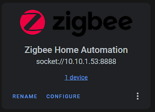](https://1.bp.blogspot.com/-aNbE3b0A_j0/XxyEwuVfVsI/AAAAAAAEcAo/dgcnpV9_NdI43hfAUXtuRYB87p1Nt_NWgCLcBGAsYHQ/s379/zigbee_int.png)

  

So how do we flash this?  First and foremost, there's **NO** soldering; don't close the window just yet!  It's relatively easy to do.  This is a full step by step walk through, some of the Tasmota veterans can skip many of the steps such as adding Tasmota to your WiFi network. 

  

During this process we will need a few pieces of software and files to flash things.  We are using Windows 10 during this process, feel free to grab the alternative versions if you are using Linux, Mac, etc.  

  

**#1** [Tasmotizer](https://github.com/tasmota/tasmotizer/releases) - Downloads the firmware and flashes the Bridge.  Some users have reported Tasmotizer does not work on their setup, as an alternative you can use [NodeMCU Py-Flasher](https://github.com/marcelstoer/nodemcu-pyflasher/releases) and manually download the [tasmota-zbbridge.bin](http://thehackbox.org/tasmota/release/tasmota-zbbridge.bin), please make sure you use the DOUT flashing method with this app. 

  

Download the latest "OTA file" for the Zigbee Bridge chipset

[https://github.com/arendst/Tasmota/tree/development/tools](https://github.com/arendst/Tasmota/tree/development/tools)

  

Use the latest ncp-uart-sw-x.x.x\_115200.ota file (as of 2020/01/25 ncp-uart-sw-6.7.8\_115200.ota is recommended). Utilize the "Download" button on GitHub.  **Do not right click and save as!** This could will result in a HTML file being downloaded instead of the actual file.

  

**#2** Turn the Zigbee Bridge over and open it, there are four small Phillips screws on the bottom under the feet pads.  There are no wires or anything inside, just a simple PCB in a case.  Turn over the board and you'll notice they labeled all the via holes for us.  

  

[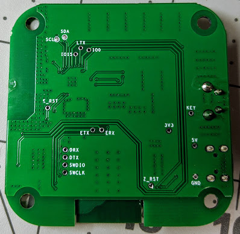](https://1.bp.blogspot.com/-ZXy0quy7jCU/XxyHl_6BoaI/AAAAAAAEcCw/TCPEVBWFuXES0WCWWao0Ik72OHBUdQBGwCLcBGAsYHQ/s398/board_bottom.jpg)

  

For ease of flashing I use typical breadboard jumpers inserted into female to female dupont jumpers attached to the USB TTL adapter as dupont male jumpers are usually too large.  **Please remember to set your USB TTL adapter to 3v3 and NOT 5v.**   If you do not have any breadboard jumpers, be creative, I've people use CAT5e wires too.

  

[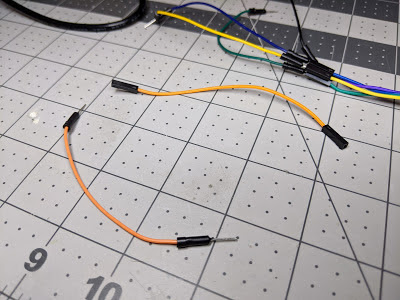](https://1.bp.blogspot.com/-4-KDapLaDlI/XxyHvkoXghI/AAAAAAAEcC0/fPgvLGruAiwYtNC7Q4tCcP86xUhIUjYCwCLcBGAsYHQ/s400/jumpers.jpg)

  

Attach the jumpers from the Zigbee bridge to the [USB TTL](https://amzn.to/2W8ocUL) (Amazon) or [CH340G](https://amzn.to/31Udrrp) or ([Aliexpress](https://s.click.aliexpress.com/e/_d8UjLRI)) as follows; (do NOT force them in the holes as this will damage the board, the jumper should be small enough to fit in the hole without the use of any force)

  

ETX to RX   (Note the RX to TX and TX to RX)

ERX to TX

3V3 to 3V3

GND to GND

IO0(GPIO Zero) to GND

  

[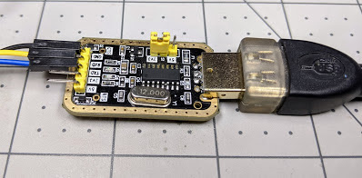](https://1.bp.blogspot.com/-4Y5QlMmDzhI/XxyH5XJCXcI/AAAAAAAEcC8/qZOADlAm7b0WgWG7luhgIQGYSqWJAj1XgCLcBGAsYHQ/s398/USBTTL.jpg)

  

Example USB TTL

  

  

**#3** Plug in the USB TTL to your computer and open Tasmotizer (run as administrator might be required if it crashes).  In the odd case of your antivirus notifying you, it's a [false positive](https://github.com/pyinstaller/pyinstaller/issues/3802).  Choose your com port for the USB TTL flasher.  Select the Release radio button and choose **tasmota-zbbridge.bin** as shown below. 

  

[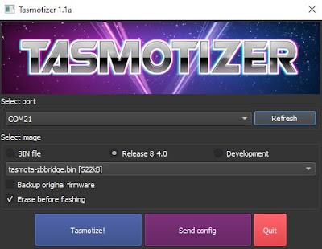](https://1.bp.blogspot.com/-I90GVHUe-zM/XyLWl7cA_qI/AAAAAAAEcMM/8AhdgiwqyiIlTHUqPUJF7rX0n9ivuKr0ACLcBGAsYHQ/s485/tasmotizer_zbbridge.JPG)

  

Press Tasmotize! and it should start the flashing process.  If not check your connections and COM port and try again.  If the flash is still not successful, try applying ground to the Z\_RST pad during the flashing process, this will force the Zigbee chipset to be quiet during the process.

  

  

Once the flashing is complete, unplug the USB TTL flasher, remove the wires from the Zigbee bridge, and power it back up via the normal USB power connector using a proper 1A or more power supply.  You can also put it back in the case if needed. 

  

**#4** Using your phone or computer, scan for available access points and look for a Tasmota-xxxx WiFi access point.

  

[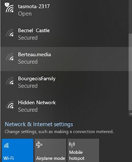](https://1.bp.blogspot.com/-JuOz5qKcVYk/XxyFE9LkNwI/AAAAAAAEcA0/nJEVt4rDS1EFJWEFpDgvot4eKNu_GU1QgCLcBGAsYHQ/s438/AP_list.png)

  

Connect to the AP and browse to 192.168.4.1 

  

[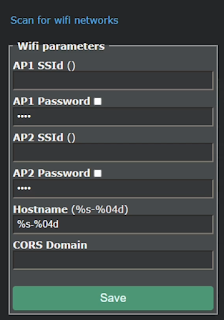](https://1.bp.blogspot.com/-ooh6a3Wzw1E/XxyFKcEk8kI/AAAAAAAEcA4/xspoPavECJQs8b70xKChNLmZX56_LC4iQCLcBGAsYHQ/s812/ap_menu.png)

  

Click "Scan for wifi networks".  Select your network, enter the AP1 Password, select the check box next to it to verify you typed it correctly, then hit Save.  The bridge will reboot and attach to your WiFi network.  

  

**#5** You will need to consult your router/dhcp server to determine the IP address of the new device.  Browse to this new IP address.

  

  

Click Console and paste in the following command on one line and hit enter:

  

_Backlog Weblog 3; so65 1; Module 75_

  

  

Tasmota will restart after a few seconds, once the reboot is complete, click Main Menu.

  

  

[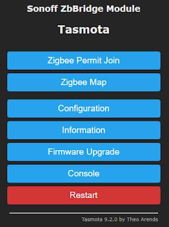](https://1.bp.blogspot.com/-dul1xHcwm8Y/YEJkt_KMY2I/AAAAAAAEn70/0NCN_RsC3Z4Cdmu46l33td25LaJIPVr_gCLcBGAsYHQ/s502/Tasmota_9.2.0_zigbee.png)

  

To verify the process flashes, it is recommended to open a second window with the Tasmota Console on it and use another window to flash the Zigbee chipset firmware. Click Firmware Upgrade, in the "Upgrade by file upload" box use the browse button and select the [ncp-uart-sw ota file](https://github.com/arendst/Tasmota/tree/development/tools/fw_SonoffZigbeeBridge_ezsp) downloaded previously. 

  

[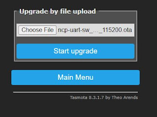](https://1.bp.blogspot.com/-K7syEFSuWXI/Xx8nctza-FI/AAAAAAAEcKU/kNWs7SYPOlA65SnHVSboef0k7Y5hMIw-wCLcBGAsYHQ/s417/sonoff_zig3.JPG)

  

Press Start upgrade.  This will instruct Tasmota to flash the Zigbee chipset on the bridge that is necessary to integrate with the Zigbee Home Assistant integration.

  

  

The file will be flashing in the background.  **Do not restart or power cycle the device!**  You can click Main Menu, then click Console to see the process. Note the XMD: commands, as Tasmota is pushing the OTA file via Xmodem to the Zigbee chipset automatically for you.  

  

If you do not see this XMD: Successful message, **do not continue** on past this point as the ZHA process will not work.  Try pushing the OTA file upload through the above process again.  **Please verify there are no wires attached to the RX/TX pins and the bridge is powered through the bridge USB port with a proper USB cable and power supply.**  A couple things you can try if you continue to receive have issue: change the power supply and change the power cable.  

  

[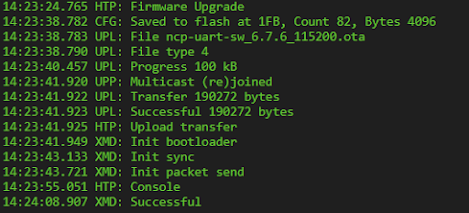](https://1.bp.blogspot.com/-mebZ8M8s8KM/YABIxDG0BOI/AAAAAAAEmSI/NuImXlH-rhQuEhyiHximxWZPlbILik8OgCLcBGAsYHQ/s532/zigbee_xmodem_success.PNG)

  

Once the process is complete Tasmota will reboot and attempt to start Tasmota Zigbee. 

  

[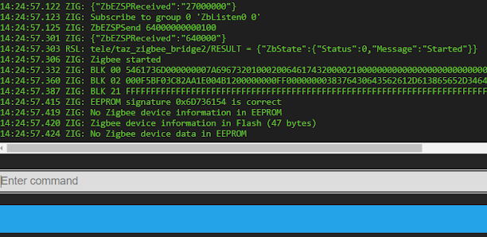](https://1.bp.blogspot.com/-IQN-Ixm4-Rg/YABJFdiveHI/AAAAAAAEmSQ/qaI9rPyUFPIjG0I4nnfoLd5d6KAecrUNACLcBGAsYHQ/s781/zigbee_started.PNG)

  

If you do not see the Tasmota Zigbee message of Zigbee started in the console do not continue past this point as this means the Zigbee chipset did not flash properly!  A couple things you can try if you continue to have this issue: change the power supply and change the power cable.  A last ditch effort if you still can't get the Zigbee chipset to flash is to update the bridge to the last developer version of Tasmota.  

  

**#6** Issue the following command on the console to map the Zigbee chip to TCP Server Port 8888:

  

_backlog rule1 on system#boot do TCPStart 8888 endon ; rule1 1 ;_ _template {"NAME":"Sonoff ZHABridge","GPIO":\[56,208,0,209,59,58,0,0,0,0,0,0,17\],"FLAG":0,"BASE":18} ; module 0_

Once the console reboots you should see the server has started on Port 8888:

17:35:58 TCP: Starting TCP server on port 8888

17:35:58 RSL: stat/tasmota\_7FC5B0/RESULT = {"TCPStart":"Done"}

  

Last but not least, while we are here, let's set the update URL to the Zigbee Bridge variant.  This will prevent your future self from breaking your ZHA integration with an upgrade of the wrong bin file.  Enter the following on the Tasmota console.

_otaurl http://ota.tasmota.com/tasmota/tasmota-zbbridge.bin.gz_

  

**We are done with Tasmota!  Let's jump into Home Assistant.** 

**#7** Go to Configuration, Integrations, hit the Plus to add a new integration.  Select **Zigbee Home Automation**.

  

[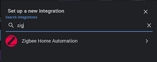](https://1.bp.blogspot.com/-9pnrfqaKgOw/XxyGYbWsPuI/AAAAAAAEcBs/suXZ5u2Oagk6cKztMYic_Wa4sL10zPlSwCLcBGAsYHQ/s594/zha1.png)

  

Choose "Enter Manually" and hit Submit.

  

[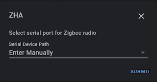](https://1.bp.blogspot.com/-qVCKJZJ5ezw/XxyGcXDe7hI/AAAAAAAEcBw/YWVRlgOQoJAcY-4GhwINPo52aN2b8HJFQCLcBGAsYHQ/s439/zha2.png)

  

Radio Type is EZSP

  

[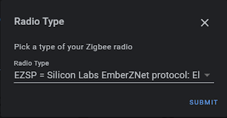](https://1.bp.blogspot.com/-15EvVgbhoNg/XxyGhcKO2GI/AAAAAAAEcB4/eALjQMZQr5wNuD1MLgSY0SwVmYc52j5_wCLcBGAsYHQ/s440/zha3.png)

  

Enter _socket://`<your bridge IP>`:8888_ and use 115200 for the port speed.  Hit submit.

  

[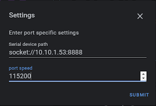](https://1.bp.blogspot.com/-qKcc_ZeC3O8/XxyGkRVfUXI/AAAAAAAEcCA/Jc7x0TQy2IwIcvQ0eR5bjrxWyE-KTXccQCLcBGAsYHQ/s440/zha4.png)

  

Give it a few seconds to query the device and you should see the following screen.

  

[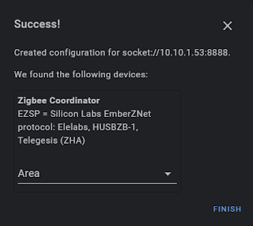](https://1.bp.blogspot.com/--N0lM0FkyOk/XxyGnnpB6LI/AAAAAAAEcCE/WfYdwzrhDekxfRvfWIAfEVIMEBThS2MJwCLcBGAsYHQ/s438/zha5.png)

  

Congratulations!  You did it!  Hit Finish.  You should now have a Zigbee integration in Home Assistant.  Click Configure.

  

  

Hit the Plus and start pairing your various Zigbee devices.  

  

[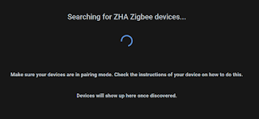](https://1.bp.blogspot.com/-_DvscIvzK-I/XxyGvRs_tBI/AAAAAAAEcCQ/38EpbABNvYESHVpHbdLFfW5T17smcOO2gCLcBGAsYHQ/s772/zha7.png)

  

  

  

You are all done! Add all your various Zigbee device types and enjoy! We will continue to update this guide as things get shorter with the process to flash the device.  Be sure to stop in, [read the process](https://github.com/arendst/Tasmota/issues/8583) of the reverse engineering this device and thank the developers of Tasmota.  

  

Be sure to check us out on [YouTube](https://www.youtube.com/digiblurDIY) and [Discord](https://discord.gg/bNtTF2v) if you have any questions.  

  

**Sonoff Zigbee Products**

  

[Zigbee Bridge(Amazon US)](https://amzn.to/37hxP8l)

[Zigbee Bridge](https://shrsl.com/39qod)(iTead) - [Zigbee Bridge(Banggood)](https://www.banggood.com/custlink/KmKyphupwA) 

[Pre-Flashed with Tasmota - SKIP this Guide (Ebay)](https://ebay.us/yoqyCZ)

[Pre-Flashed with Tasmota from Cloudfree - SKIP this Guide](https://cloudfree.shop/product/sonoff-zigbee-bridge-flashed-with-tasmota/?ref=digiblur)

[Zigbee Mini Switch](https://shrsl.com/2l573)

[Zigbee Switch](https://shrsl.com/2eix7)

[Zigbee Temperature and Humidity Sensor](https://shrsl.com/2eixb)

[Zigbee PIR Motion Sensor](https://shrsl.com/2eixj)(Junk!)

[Zigbee Door/Window Sensor](https://shrsl.com/2eixl)

  

**Products We Use/Recommend**

Amazon US - [https://amzn.to/2YZNDeO](https://amzn.to/2YZNDeO)

Amazon UK - [https://amzn.to/3gVLiFZ](https://amzn.to/3gVLiFZ)

Amazon CA - [https://amzn.to/2HchPZe](https://amzn.to/2HchPZe)

  

Discord Chat - [https://discord.gg/bNtTF2v](https://discord.gg/bNtTF2v) 

Patreon -  [https://www.patreon.com/digiblurDIY](https://www.patreon.com/digiblurDIY)

  

  

Links to products provided by the ShareASale and Amazon Affiliate program.
