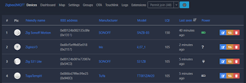
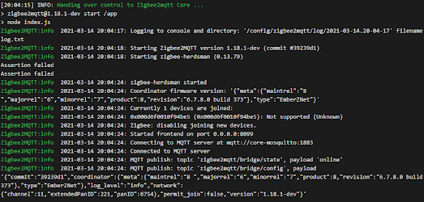

 

If you've been using your Zigbee bridge with the ZHA integration and don't like some of the oddities of buttons using ZHA Events, etc or simply just want to detach from HA, or even enable support more devices; it's time to jump on over to Zigbee2MQTT.  Previously there wasn't the ability to use Zigbee2MQTT if you were using the Sonoff Zigbee Bridge.  It is currently in the development branch of Zigbee2MQTT if you want to give it spin.  Trust me, it's well worth it!!  

Still using your Sonoff Zigbee Bridge with the cloud?  Take it out of the cloud with this guide! [https://www.digiblur.com/2020/07/how-to-use-sonoff-zigbee-bridge-with.html](https://www.digiblur.com/2020/07/how-to-use-sonoff-zigbee-bridge-with.html)

iTead also is now selling their [USB 3.0 dongle](https://shrsl.com/2ur07) that uses the same chip as the Zigbee Bridge.  It is preflashed with correct firmware out of the box that can also be used with ZHA and Zigbee2MQTT using the same procedure as below with the USB port.

If you are using the ZHA integration at this time I would suggest removing all your devices from the ZHA integration and then remove the integration itself as you can not point two integrating pieces of software at the bridge at the same time.  If you were using TasmotaZigbee or using a newly flashed Sonoff Zigbee Bridge,  follow [the guide](https://www.digiblur.com/2020/07/how-to-use-sonoff-zigbee-bridge-with.html) to set the correct template and rules to start the TCP server on the bridge.  Once you get to the Home Assistant part adding it as ZHA, stop following [the guide](https://www.digiblur.com/2020/07/how-to-use-sonoff-zigbee-bridge-with.html).

**"Supervisorless" installs of Home Assistant**, you'll simply need to pull the docker container for zigbee2mqtt, a recent production or developer build is fine..  More info can be found here.  [https://www.zigbee2mqtt.io/information/docker.html](https://www.zigbee2mqtt.io/information/docker.html)

**Supervisor based installs of Home Assistant**, add the repository URL under Supervisor → Add-on store → ⋮ → Manage add-on repositories: https://github.com/zigbee2mqtt/hassio-zigbee2mqtt  This will add two versions of Zigbee2MQTT to the addon store.  Install the zigbee2mqtt version you prefer, production or developer is fine.  

The configuration to use the bridge will be very similar for both Supervisor and non-Supervisor installs.  Either in the add-on configuration or the configuration.yaml file for the docker container, the adapter configuration is (replace the IP address with your local bridge IP):

serial:

  adapter: ezsp

  port: 'tcp://10.10.1.20:8888'

If this is your first install I would highly recommend skimming through the docs for additional setup options at [https://www.zigbee2mqtt.io](https://www.zigbee2mqtt.io/) and please remember to secure your network by by setting the network key as GENERATE.  Sorry Supervisor users you'll need to make up your own random key as it doesn't seem to be supported by the supervisor yet.  See more here - [https://github.com/zigbee2mqtt/hassio-zigbee2mqtt/issues/41](https://github.com/zigbee2mqtt/hassio-zigbee2mqtt/issues/41)

Once you have it configured, start up the container/add-on and fingers crossed...check the logs to see if everything started correctly.  If not, be sure your bridge rule is still enabled to start the TCP server on port 8888 and your network can reach it.  

Enjoy!  Open the GUI interface and start pairing up your devices.  If you have some additional info to post in order to help with the testing and development of this adapter type, you can share it here: [https://github.com/Koenkk/zigbee-herdsman/issues/319](https://github.com/Koenkk/zigbee-herdsman/issues/319)

Other Resources - Upgrade the [HUSBZB-1 Nortek Zwave/Zigbee USB Stick](https://amzn.to/3bN403e) to also use Zigbee2MQTT - [https://github.com/walthowd/husbzb-firmware](https://github.com/walthowd/husbzb-firmware) (UPDATE: Zigbee2MQTT not starting)

⚡Products We Use/Recommend

Amazon US - [https://amzn.to/2YZNDeO](https://amzn.to/2YZNDeO)  
Amazon UK - [https://amzn.to/2TnG2R4](https://amzn.to/2TnG2R4)  
Amazon CA - [https://amzn.to/2JWsNq5](https://amzn.to/2JWsNq5)  
  

⚡Be Social!⚡  
Discord Chat - [https://discord.gg/bNtTF2v](https://discord.gg/bNtTF2v)  
Patreon - [https://www.patreon.com/digiblurDIY](https://www.patreon.com/digiblurDIY)  
Facebook - [https://www.facebook.com/groups/digiblurdiy](https://www.facebook.com/groups/digiblurdiy)  
Instagram - [https://www.instagram.com/digiblurdiy](https://www.instagram.com/digiblurdiy)  
Please note that links above may be an affiliate link, utilization could earn digiblurDIY a small commission of most purchases and helps with future video projects. Thank you!
