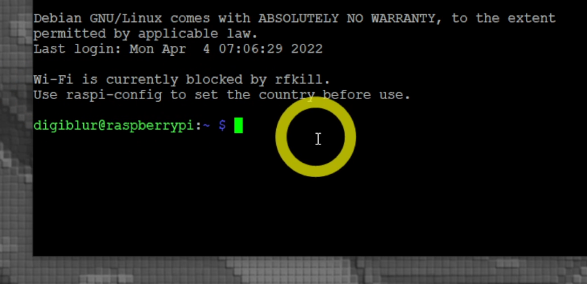

Remember the days of Tuya-Convert where you could obtain a Tuya based Wi-Fi Smart device, run a quick exploit via a Raspberry-Pi and load your own copy of Tasmota or ESPHome firmware right on the device?  Things were patched unfortunately and then later the chipsets were changed to a Beken based chipset that wouldn't run Tasmota at all.  So we resorted to chip swapping with hot air guns, soldering etc to get our favorite local non-cloud firmware on the device.  Things are now going full circle again where we can load firmware on the Beken chipsets with an over the air exploit called [tuya-cloudcutter](https://github.com/tuya-cloudcutter/tuya-cloudcutter)  It is such an awesome process and down right addictive!.  Then the bigger accomplishment is the [Libretuya](https://docs.libretuya.ml/) project has it all working with ESPHome!  No additional firmware to learn especially for the ESPHome folks.  It all integrates with Home Assistant like any other ESPHome device does.  

### What do you need?

First a device that is Beken based and on the list of exploitable devices with [tuya-cloudcutter](https://github.com/tuya-cloudcutter/tuya-cloudcutter) (more are being added all the time!).  In this example I'm using the [Globe Motion NightLight Plug](/wiki/devices/plugs/globe_50239_motion_night_light)
Second a laptop, NUC, PC, etc or [Raspberry-Pi](https://amzn.to/3Guq8OI) to run the exploit and also load the ESPHome firmware.

The instructions below are based on using a [Raspberry-Pi](https://amzn.to/3Guq8OI), if you are using a different computer you will need to adapt by using a different OS flavor but the concept is all the same.  If you are more of a full-video type of person and want the complete walk through view the video below.

### Full Video 

<iframe allowfullscreen height="353" src="https://www.youtube.com/embed/i9HokGpj-kE" width="625" youtube-src-=""></iframe>  

Read more  👉
<!--truncate-->

### Building the Raspberry Pi Image

1. Download the Raspberry Pi Imager - https://www.raspberrypi.com/software/  
2. Download the 2022-04-04 Raspberry Pi OS - https://downloads.raspberrypi.org/raspios_lite_armhf/images/raspios_lite_armhf-2022-04-07/2022-04-04-raspios-bullseye-armhf-lite.img.xz

Open the Raspberry Pi Imager - Select Choose OS - Use Custom and browse to the 2022-04-04 copy of RPI you just downloaded above.  Choose your SD card as the Storage. 


Don't forget to select the gear icon and enable SSH and set your username password


3. Write the image to the card and then place it in the Raspberry Pi.  Connect the RPI to Ethernet and power it up.  Wait a few minutes as the first boot can take some time.  Open an SSH terminal such as Putty to the IP address of the RPI.  You should see a note about Wi-Fi being unavailable.  



4. Run `sudo-raspi-config` go to Localisation Options -> WLAN Country and set your country.  Hit Finish and select Yes to Reboot.  SSH back into the RPI do the following steps to prepare for Tuya-CloudCutter

5. Install Network Manager (only reboot once all files are in place)
 - `sudo apt update && sudo apt install network-manager`
 - `sudo nano /etc/dhcpcd.conf` then add line `denyinterfaces wlan0`
 - `sudo nano /etc/NetworkManager/NetworkManager.conf` and make it look exactly like
```
[main]
plugins=ifupdown,keyfile
dhcp=internal

[ifupdown]
managed=true
```
6. Reboot the pi with `sudo reboot` then SSH back in.  

7. Install Docker with `curl -fsSL https://get.docker.com -o get-docker.sh && sh get-docker.sh`  

8. Install git with `sudo apt install git`  

9. Clone tuya-cloudcutter repo with `git clone https://github.com/tuya-cloudcutter/tuya-cloudcutter`  

### Install Libretuya ESPHome Fork

Currently Libretuya it not merged into the main fork of ESPHome, so we have to install the LT version of it.  Feel free to let the devs know in this PR if this fork works for you and vote to have it merged!  https://github.com/esphome/esphome/pull/3509  

10. Clone the libretuya-esphome repo with `git clone https://github.com/kuba2k2/libretuya-esphome`

11. Change to the libretuya folder with `cd libretuya-esphome`

12. Build the docker container with `sudo python3 docker/build.py --tag libretuya --arch armv7 --build-type docker build`  if you are not using a Raspberry Pi, change the arch to `amd64`

13. Change back to the home folder with `cd ..`

14. Run the docker container to enable the ESPHome Dashboard with `sudo docker run -d -v /opt/esphome:/config:rw -v /etc/localtime:/etc/localtime:ro -p '6052:6052/tcp' --name esphome-libretuya esphome/esphome-armv7:libretuya`

15. Open a browser to your Raspberry Pi IP on port 6052.  Example `http://192.168.1.9:6052`  This will allow you to build your ESPHome firmware for the device.  The Globe Plug YAML is located on the [Globe Night Light configuration page](/wiki/devices/plugs/globe_50239_motion_night_light)

Your Raspberry Pi is now ready to be used with Tuya-Cloudcutter and also functions as the LibreTuya ESPHome Dashboard to manage the devices until it is merged into the regular version of ESPHome. 

To Run cloudcutter on the RPI use `sudo ./tuya-cloudcutter.sh -r ` refer to the [usage instructions](https://github.com/tuya-cloudcutter/tuya-cloudcutter/blob/main/INSTRUCTIONS.md) 

It will take a few minutes for the first initial run to pull down the files and build the docker container.  Follow the on screen instructions to flash custom firmware and/or cloudcut the device.  Refer to the video above for more in depth steps of this process or come join us in Discord for additional help using the link in the page footer below.


