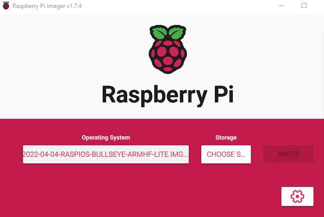
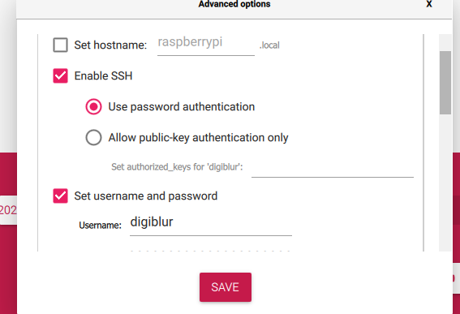
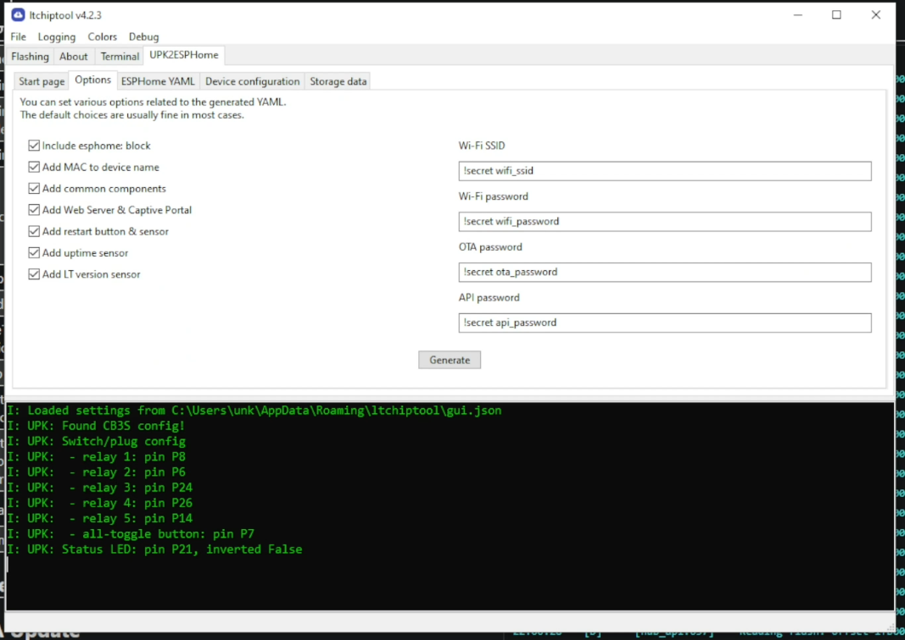
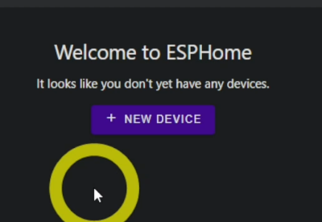
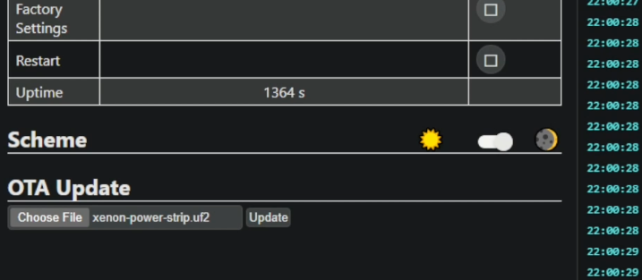

***UPDATED Guide to Load ESPHome all over the air on Tuya Beken SmartHome Devices

**The entire process we covered 3 or 4 months ago just became 10 times easier thanks to efforts of the Libretiny and Tuya-CloudCutter developers!**

Remember the days of Tuya-Convert where you could obtain a Tuya based Wi-Fi Smart device, run a quick exploit via a Raspberry-Pi and load your own copy of Tasmota or ESPHome firmware right on the device?  Things were patched unfortunately and then later the chipsets were changed to a Beken based chipset that wouldn't run Tasmota at all.  So we resorted to chip swapping with hot air guns, soldering, etc. to install our favorite local & open source firmware on the device.  Things are now going full circle again where we can load firmware on the Beken chipsets with an over the air exploit called [tuya-cloudcutter](https://github.com/tuya-cloudcutter/tuya-cloudcutter)  It is such an awesome process and down right addictive!.  Then the bigger accomplishment is the [LibreTiny](https://docs.libretiny.eu/) project has it all working with ESPHome!  No additional firmware to learn is awesome especially for the ESPHome veterans!  Plus it all integrates with Home Assistant like any other ESPHome device does.  

### Overview of the Process

1.  [Create the Tuya-Cloudcutter Exploit Device using a Rasperry Pi or other Linux Based setup](updated-tuya-cloudcutter-with-esphome-bk7231-how-to-guide#building-the-raspberry-pi-image)

2.  [Install / Update Tuya-CloudCutter](updated-tuya-cloudcutter-with-esphome-bk7231-how-to-guide#install--update-tuya-cloudcutter)

3.  [Install ESPHome Kickstarter firmware on the Device](updated-tuya-cloudcutter-with-esphome-bk7231-how-to-guide#install-esphome-kickstarter-firmware-on-the-device)

4.  [Use LT Chip Tool to configure the device](updated-tuya-cloudcutter-with-esphome-bk7231-how-to-guide#lt-chip-tool-to-configure-the-device)

5.  [Install ESPHome Libretiny Add-On or Docker Container](updated-tuya-cloudcutter-with-esphome-bk7231-how-to-guide#install-esphome-libretiny-add-on-or-docker-container)

6.  [Install the ESPHome Firmware and Integrate into Home Assistant](updated-tuya-cloudcutter-with-esphome-bk7231-how-to-guide#install-esphome-firmware-and-integrate-into-home-assistant)

### What do you need?

First a device that is Beken based and on the list of exploitable devices with [tuya-cloudcutter](https://github.com/tuya-cloudcutter/tuya-cloudcutter) (more are being added all the time!).  In this example I'm using the [Globe Motion NightLight Plug](/wiki/devices/plugs/globe_50239_motion_night_light)
Second a laptop, NUC, PC, etc or [Raspberry-Pi](https://amzn.to/3Guq8OI) to run the exploit and also load the ESPHome firmware.

### Device I've Cloudcut and put ESPHome on 
NightLight Plug WB3S - https://amzn.to/3KC5ajh   
XMCosy Landscape Lights - https://amzn.to/44aUONW  
UltraPro Switch - https://amzn.to/44fI4W7  
Xenon Power Strip - https://amzn.to/47P97ea  
Cree 5 Button Switch - https://amzn.to/44i15rh  
UltraPro Switch - https://amzn.to/3sbh8JQ  
Fan/Dimmer Controller - https://amzn.to/3sddaAp  
Feit Power Strip - https://amzn.to/45xGlfT  

The instructions below are based on using a [Raspberry-Pi](https://amzn.to/3Guq8OI), if you are using a different computer you will need to adapt by using a different OS flavor but the concept is all the same.  If you are more of a full-video type of person and want the complete walk through view the video below.

### Full Video 

<iframe allowfullscreen height="353" src="https://www.youtube.com/embed/VFsuza3UAhk" width="625" youtube-src-=""></iframe>  

Read more  👉
<!--truncate-->

### Building the Raspberry Pi Image

1. Download the Raspberry Pi Imager - https://www.raspberrypi.com/software/  
2. Download the 2022-04-04 Raspberry Pi OS - https://downloads.raspberrypi.org/raspios_lite_armhf/images/raspios_lite_armhf-2022-04-07/2022-04-04-raspios-bullseye-armhf-lite.img.xz

Open the Raspberry Pi Imager - Select Choose OS - Use Custom and browse to the 2022-04-04 copy of RPI you just downloaded above.  Choose your SD card as the Storage. 



Don't forget to select the gear icon and enable SSH and set your username password



3. Write the image to the card and then place it in the Raspberry Pi.  Connect the RPI to Ethernet and power it up.  Wait a few minutes as the first boot can take some time.  Open an SSH terminal such as Putty to the IP address of the RPI.  You should see a note about Wi-Fi being unavailable.  


4. Run `sudo raspi-config` go to Localisation Options -> WLAN Country and set your country.  Hit Finish and select Yes to Reboot.  SSH back into the RPI do the following steps to prepare for Tuya-CloudCutter

5. Install Network Manager (only reboot once all files are in place)
 - `sudo apt update && sudo apt install network-manager`
 - `sudo nano /etc/dhcpcd.conf` then add line `denyinterfaces wlan0`
 - `sudo nano /etc/NetworkManager/NetworkManager.conf` and make it look exactly like
```
[main]
plugins=ifupdown,keyfile
dhcp=internal

[ifupdown]
managed=true
```
6. Reboot the pi with `sudo reboot` then SSH back in.  

7. Install Docker with `curl -fsSL https://get.docker.com -o get-docker.sh && sh get-docker.sh`  

### Install / Update Tuya-CloudCutter

If you've already previously built a Tuya-CloudCutter Raspberry Pi, SSH into the Pi and do the following.  

```
cd tuya-cloudcutter
git pull
```

Otherwise continue with the steps below:

1. Install git with `sudo apt install git`  

2. Clone tuya-cloudcutter repo with `git clone https://github.com/tuya-cloudcutter/tuya-cloudcutter`  

### Install ESPHome Kickstarter firmware on the Device

1. Change to the tuya-cloudcutter folder if necessary with `cd tuya-cloudcutter`

2. Run Tuya-Cloudcutter (might take some additional time on the initial run to build the application container) `./tuya-cloudcutter.sh -r`

3. Select Option #2 - Flash 3rd Party Firmware

4. Select the Manufacturer/Device Name if your device is listed.  If it is not listed, pair the device with the Tuya smartphone app and check for updates on the device to view the firmware version.  Restart the cloudcutter script and select `By Firmware version` try the exploits with the same version number.  You might have to try the process multiple times if multiple of the same version are listed

5. Select the ESPHome-Kickstart firmware when prompted.  

6. Follow the on screen directions to exploit the device and install ESPHome Kickstarter.

7. Once the device is successfully flashed, connect to the `Kickstart-bk7231` access point via WiFi. Navigate to `http://192.168.4.1` if the page does not auto direct.  Connect it to your WiFi.  Check your Wi-Fi Router/Access Points for a new device with this name and make a not of this IP Address for the next section.


### LT Chip Tool to configure the device

If your device already has a device profile on tuya-cloudcutter you can skip the steps below and pull the config from the UPK2ESPHome website https://upk.libretiny.eu/

1.  Download the latest ltchiptool from the releases https://github.com/libretiny-eu/ltchiptool/releases

2.  Open/Run ltchiptool and accept any warnings if necessary.

3.  Select the UPK2ESPHome tab, Click `Grab from ESPHome-Kickstart`, enter the IP address not above or the kickstart-bk7321n or kickstart-bk7321t hostname

4.  If the device is succesfull, the config will be shown of the layout of the GPIO pins.  Change any necessary options if you like and hit Generate to create the ESPHome YAML config that will be used in the next step.  



### Install ESPHome Libretiny Add-On or Docker Container

1.  HAOS Users need to add the following Add-On store repository URL `https://github.com/libretiny-eu/esphome-hass-addon`  Refresh the page and install the Libretiny ESPHome Addon


2.  unRaid Users can search for libretiny and install the docker container - be sure to change the WebGUI on the container to 6053 as unRaid CA changes it to 6052 which would impact the normal ESPHome container.


3.  Docker Run / Docker-compose users - Install and configure the container for use
```
version: "3"
services:
  esphome:
    container_name: esphome-libretiny
    image: docker pull ghcr.io/libretiny-eu/libretiny-esphome-docker:latest
    volumes:
      - ./configs:/config:rw 
      - /etc/localtime:/etc/localtime:ro
    restart: always
    privileged: false
    network_mode: host
```

### Install ESPHome Firmware and Integrate into Home Assistant

1.  Create a new device in ESPHome Libretiny (make sure you are not using your standard ESPHome GUI without libretiny)



2.  Copy the generated ESPHome YAML from the LTChipTool or the UPK2ESPHome website https://upk.libretiny.eu/ into the device config.  Change any necessary options and select Install.  Choose Manual Download -> Modern Format

3.  The firmware will compile and download a UF2 file to your computer.  Navigate to the original IP or Hostname of the ESPHome Kickstarter.  Scroll down to the OTA Update section, select Choose file, select the UF2 file that was created and hit update.  



4.  Once the device updates to the firmwmare for the device.  Open Home Assistant and check for new devices that were auto discovered.  Depending on your system you might have to manually add a new ESPHome integration device.  


Any future updates or changes to the ESPHome Libretiny based Beken device will all be done through the ESPHome GUI like any normal ESPHome device via the Wirelessly update option of ESPHome.  

Devices I've tried and used but there are so many more out there...

NightLight Plug WB3S - https://amzn.to/3KC5ajh   
XMCosy Landscape Lights - https://amzn.to/44aUONW  
UltraPro Switch - https://amzn.to/44fI4W7  
Xenon Power Strip - https://amzn.to/47P97ea  
Cree 5 Button Switch - https://amzn.to/44i15rh  
UltraPro Switch - https://amzn.to/3sbh8JQ  
Fan/Dimmer Controller - https://amzn.to/3sddaAp  
Feit Power Strip - https://amzn.to/45xGlfT  
