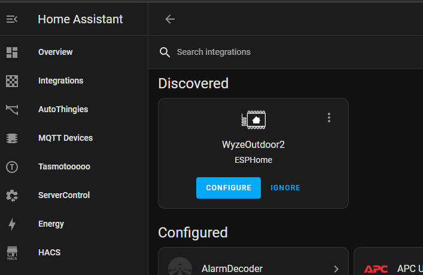
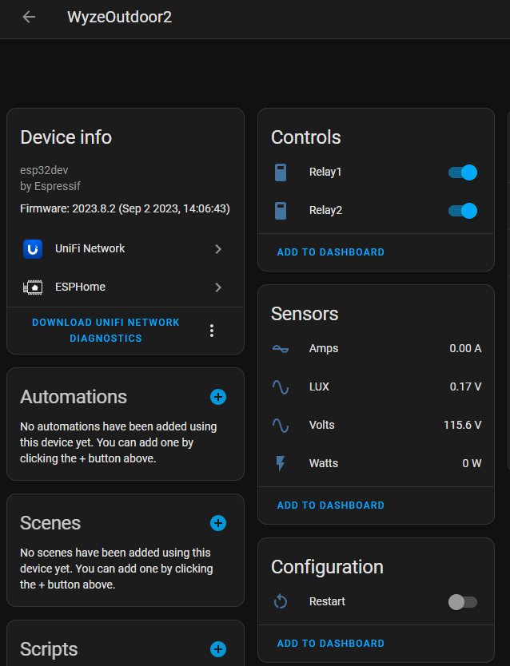

## The Why?

Why do we need a bluetooth proxy for [Home Assistant](https://www.home-assistant.io/)?  The answer is simple!  Sometimes Bluetooth Low-Energy devices have craptastic range.  Many of us have spend time, effort, and money to build out excellent Wi-Fi coverage in our homes and even backyards.  So why not harness the power of this coverage and use it to communicate with Bluetooth devices.  This is exactly what Bluetooth Proxies do!  You can put some [SwitchBot temperature sensors](https://amzn.to/47opqyp) in the backyard or even a Bluetooth pool sensor in the pool and have all the data automatically brought into Home Assistant.  Any many other [Bluetooth HA compatible devices](https://digiblur.com/wiki/ha/bluetooth-compatible-devices). While you can easily place a NodeMCU ESP32 board outdoors to accomplish this, it might not always be ideal for cosmetic reasons or even for water proofing reasons.  

[Other Bluetooth HA compatible devices](https://digiblur.com/wiki/ha/bluetooth-compatible-devices)
FCC ID of [2AUIU-WLPPO1](https://fccid.io/2AUIUWLPPO1)

This is where the [Wyze Outdoor Plug](https://amzn.to/3r1l5k4) comes into play.  It's IP64 dual relay plug with power monitoring, LUX sensor and since it has an onboard dual core ESP32 chip we can use it with [ESPHome](https://esphome.io/) as a bluetooth proxy for Home Assistant.  It also comes with a little better quality WiFi/Bluetooth antenna than your standard PCB antenans.  And yes, we have a no soldering solution!  Let's get started!

Read more  👉
<!--truncate-->

### Parts Needed

1. Wyze Plug Outdoor - [Amazon](https://amzn.to/3r1l5k4) or from [Wyze.com WLPP01](https://www.wyze.com/products/wyze-plug-outdoor)
2. USB TTL adapter - ["Little red guy CP2102"](https://amzn.to/3R5obhx) or [Voltlink USB TTL](https://www.tindie.com/products/voltlog/voltlink-cp2102n-usb-serial-adapter-programmer/)
3. [Dupont jumper wires](https://amzn.to/45BvX7h) 
4. [Optional but highly recommended USB data switch](https://amzn.to/44DO5vY)
5. BDM Frame with pins [Amazon](https://amzn.to/3R2EkV6) or [Aliexpress](https://s.click.aliexpress.com/e/_DdAVZt1) 
6. Extra BDM pins if necessary as some only come with 4 pins we need 5
7. Triangle bit screw driver - If you do not have one, it's time to get a nice kit for future projectss  You can cheap out of course and get a cheap kit, but if you want a nice one, I can't say how impressed I am with the quality on the iFixit toolkit (they didn't sponsor this).  [iFixIt Kit](https://amzn.to/3fhaQQz) or others [kits](https://amzn.to/3suihr8)


If you are a pro at soldering, of course you can skip the BDM frame and just solder to the pads on the plug.

### Disassembly of the Plug

1. Pop out the rubber covers to expose the 5 screws on the bottom.


2. Remove the screws.  There's no need to remove the main board from the case itself.  It is almost like they designed this device to be opened!


3. You'll be greeted with the ESP32 module and the nicely labeled flashing pads.  In my older picture I soldered mine but you can also use a BDM frame for the non-soldering solution.


### Connecting to the Plug

BDM Frame Method


Right next to the module is GND, RX, TX and BOOT.  Boot is your GPIO 0 pin that needs to be held to ground to enable the flash mode.  Where's 3.3v?  It's tucked up under the mains AC lines. 


Please do not attempt to power this via Mains AC while you have the USB TTL attached to it or when you have the case open!

If you only have one Ground pin on your USB TTL adapter for flashing, I use a simple solder bridged header pin to make a splitter.  Make sure your USB TTL is on 3v3 and NOT 5v!  You could also just twist three wires together to make a splitter.  If you are using the Voltlink adapter, it of course has extra ground pins.  


Connect the following pins from the Wyze Plug to the USB TTL adapter. 3v3-3v3, GND-GND, RX-TX, TX-RX, and BOOT to GND.

| USB TTL | Wyze Outdoor | Note |
|------ |-------------|-------------|         
|3V3	| 3V3
|GND	| GND
|RX	| TX | Transposed
|TX	| RX | Transposed
|GND	| BOOT


I also utilize a [USB power/data switch](https://amzn.to/44DO5vY) to be able to toggle the power without accidentally pulling any wires off of the plug.  Totally an optional device but after a few years of not having one, I kick myself for not getting one earlier as I can't do without it.  

### Prepare your ESPHome software

1. If you haven't installed ESPHome before, you'll need to install the Home Assistant ESPHome Add-On or if you are one of the cool kids, install the docker container for ESPHome.  [See here for more info](https://esphome.io/guides/getting_started_hassio)

2. Inside the ESPHome device panel GUI


Click + New Device, hit Continue, and give it a unique name.


Choose the Correct Variant/Board type


Click Skip


Edit the device on the ESPHome GUI and paste in the following YAML over the existing YAML code, change the name(s) as necessary.

### ESPHome YAML
```yaml
substitutions:
  # Higher value gives lower watt readout
  current_res: "0.001"
  # Lower value gives lower voltage readout
  voltage_div: "770"  
  update_time: 10s  

esphome:
  name: wyzeoutdoor
  friendly_name: WyzeOutdoor
  name_add_mac_suffix: false

esp32:
  board: esp32dev
  framework:
    type: esp-idf

logger:
api:
ota:
captive_portal:
mdns:
#web_server:
# disabled to due potential memory issues

wifi:
  ssid: !secret wifi_ssid
  password: !secret wifi_password
  ap:

esp32_ble_tracker:
  scan_parameters:
    active: true

bluetooth_proxy:
  active: true    

switch:
  - platform: gpio
    name: Relay1
    pin:
      number: GPIO15
      inverted: false
    restore_mode: ALWAYS_ON
    id: relay1
    on_turn_on:
      - light.turn_on: relay1_led
    on_turn_off:
      - light.turn_off: relay1_led
  - platform: gpio
    name: Relay2
    pin:
      number: GPIO32
      inverted: false
    restore_mode: ALWAYS_ON       
    id: relay2
    on_turn_on:
      - light.turn_on: relay2_led
    on_turn_off:
      - light.turn_off: relay2_led
  - platform: restart
    name: Restart

output:
  - platform: gpio
    pin: GPIO19
    inverted: True
    id: relay1_led_gpio
  - platform: gpio
    pin: GPIO16
    inverted: True
    id: relay2_led_gpio

light:
  - platform: binary
    name: Relay1 LED
    id: relay1_led
    restore_mode: RESTORE_DEFAULT_ON     
    internal: true    
    output: relay1_led_gpio
  - platform: binary
    name: Relay2 LED
    id: relay2_led
    internal: true
    output: relay2_led_gpio
    restore_mode: RESTORE_DEFAULT_ON         

sensor:
  - platform: adc
    pin: GPIO34
    name: LUX
    update_interval: 10s
    attenuation: 11db
  - platform: hlw8012
    sel_pin:
      number: GPIO25
      inverted: true
    cf_pin: GPIO27
    cf1_pin: GPIO26
    current_resistor: ${current_res}
    voltage_divider: ${voltage_div}
    change_mode_every: 3
    update_interval: 3s    
    current:
      name: Amps
      unit_of_measurement: A
      accuracy_decimals: 2
    voltage:
      name: Volts
      unit_of_measurement: V
      accuracy_decimals: 1
    power:
      name: Watts
      unit_of_measurement: W
      accuracy_decimals: 0    
      filters:
        - calibrate_linear:
            - 0.0 -> 0.0
            - 134 -> 58 

binary_sensor:
  - platform: gpio
    internal: true
    pin:
      number: GPIO18
      mode: INPUT_PULLDOWN
      inverted: True
    name: Button1
    on_press:
      - switch.toggle: relay1
  - platform: gpio
    internal: true
    pin:
      number: GPIO17
      mode: INPUT_PULLDOWN
      inverted: True
    name: Button2
    on_press:
      - switch.toggle: relay2

status_led:
  pin:
    number: GPIO5
    inverted: true  
```

Select Save.  Choose Install.  Select Manual Download


Select Modern Format - **DO NOT** Select Legacy


The device config will compile and download the bin to the computer default dwonload folder you are working on.


Click Close to return to the ESPHome Dashboard.

## How to Install/Flash the Modern/Factory bin of ESPHome

There are two methods.  Choose the one you are more comfortable with.  Browser based ESPHome Web Flasher (easiest) or ESPTool.py command line.  Apply power to the Wyze Outdoor plug by applying power to the USB TTL adapter.  If you've never used the USB TTL before you may need to install drivers for it.  Windows Users - check the Windows Update Optional Updates for new device drives to install.  

**Note:**  After this intial flash/install, all updates/changes can be done via the "Update via Network" option without using this manual method of plugging in the device to the computer/host.

### Install the ESPHome Factory bin via a Web Browser

Open an additional tab to ESPHome Web Tools https://web.esphome.io/  

Click Connect and select the USB TTL adapter connected.  If you do not see one listed, follow the on screen help to load the correct drivers.


Select Install.  Choose File button, browse to the bin previously downloaded from the compile procedure above and select install.


Hurry up and Wait! Some devices might require you to unplug and plug in the device to cycle power for them to boot up.  If you have GPIO 0 held to ground please remove this before trying to boot up the device into ESPHome.  Any additional updates/changes to the conifguration of the device can be done via the network update option.  Congratulations! 🎉


### Install the ESPHome Factory bin via ESPTool.py

ESPTool.py python tool is required and needs to be installed on the host machine.  [ESPTool.py installation procedure](https://docs.espressif.com/projects/esptool/en/latest/esp32/)  

```
esptool.py write_flash 0x0 your_esp32-factory.bin
```
Note: If you receive an error, try lowering the baud rate to 115200 or slower by adding the `--baud 115200` parameter.  

## Testing and Integrating into Home Assistant

Detach the USB TTL from the host computer, remove any USB TTL adapter wires and assemble the device case.  Don't forget the rubber screw plugs!   Plug in the device mains power.  This allows the device to boot into ESPHome and connecto the network.  In the ESPHome GUI, select the view logs option.  You should start seeing information scrolling by showing the successful boot of ESPHome.   


Open Home Assistant, check for auto discovered devices or manually add the ESPHome integration devices following the normal Home Assistant add device procedures.  



Enjoy and don't forget to tip your bartender!


