# Smart Ambiance Light SAL001S

Sold under many different product brands:
- Halussoer
- Lzaonzoe
- Lumary
- Cakuja
- Dekala
- JVAXS
- winees

 `3/31/2022 - This device has a secondary MCU and a Bekken chip. We will swap in ESP12F Chip and clip off the secondary MCU because it won't be needed.`

## Pinouts

    
GPIO Layout

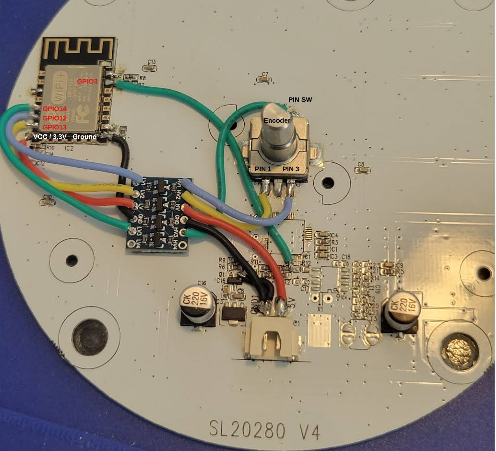

| GPIO |    Component | Description |
|------ |-------------|-------------|         
|GPIO00	| None
|GPIO01	| None
|GPIO02	| ESP12F LED | On board LED of the ESP12F chip
|GPIO03	| None | Data pin for LEDs
|GPIO04	| None
|GPIO05	| None
|GPIO09	| None
|GPIO10	| None
|GPIO12	| Encoder Pin 1 | Encoders far left pin
|GPIO13	| Encoder Pin 3 | Encoders far right pin
|GPIO14	| Encoder SW | Encoders push button switch pin
|GPIO15	| None
|GPIO16	| None

 

## Additional Hardware

You'll need to buy yourself an ESP12F chip from someplace like amazon or aliexpress

[AliExpress](https://www.aliexpress.com/wholesale?SearchText=ESP12f)

[Amazon](https://www.amazon.com/ESP8266-ESP-12F-Wireless-Transceiver-Development)

If you want to use the rotary encoder on the back you'll need a voltage logic level shifter due to the board having 5V supplied and the ESP chip only tolerating 3.3v on it's pins

[AliExpress](https://www.aliexpress.com/wholesale?SearchText=IIC+I2C+Logic+Level+Converter)

[Amazon](https://amazon.com/gp/product/B07F7W91LC)

## Pre-Flash ESP12F

    
Chip Flashing

If you don't want to use the encoder knob on the back of the lamp then you can just flash a normal release of WLED by visiting the web installer of WLED.

https://install.wled.me

If you want to use the encoder on the back you'll have to compile WLED with the encoder usermod and flash that binary.  Details can be found [here](https://gitlab.invisibleworld.de/backup/github/wled/-/blob/1a2543ddde57683bc897a602573c504dcab0fc04/usermods/usermod_v2_rotary_encoder_ui/readme.md)

 

## Open it

    
Drop it like it's hot
     

Drop it on the floor.  Don't throw it but  drop it and the two halves will pop open.

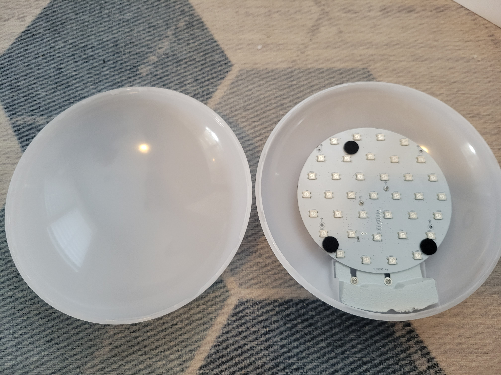

Remove the two screws in the middle of the PCB and pull the board out.

Detach the power wires and the board should come free and you'll see the chips on the back and the LEDs on the front

 

## Desolder un-needed components

    
Add Leaded Solder
 

Get some leaded solder and melt some on the existing pins of the WBR3 chip

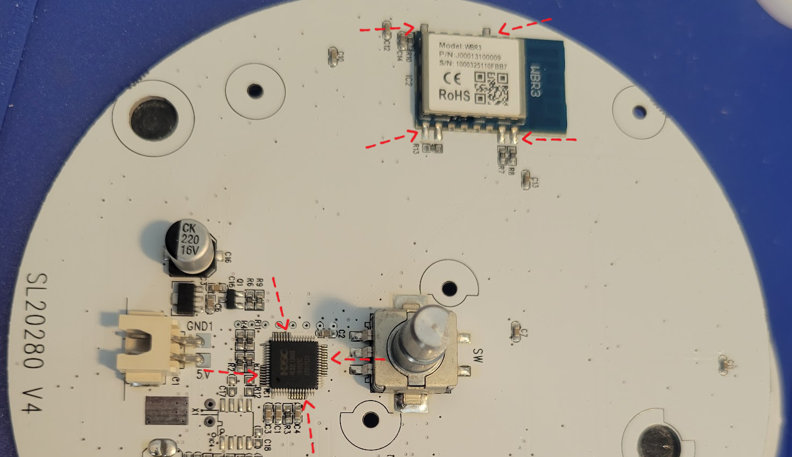

    
Heat em up! Pull em off! RAWHIDE!

Now use your hot air tool, soldering iron, or heat gun to remove the chips

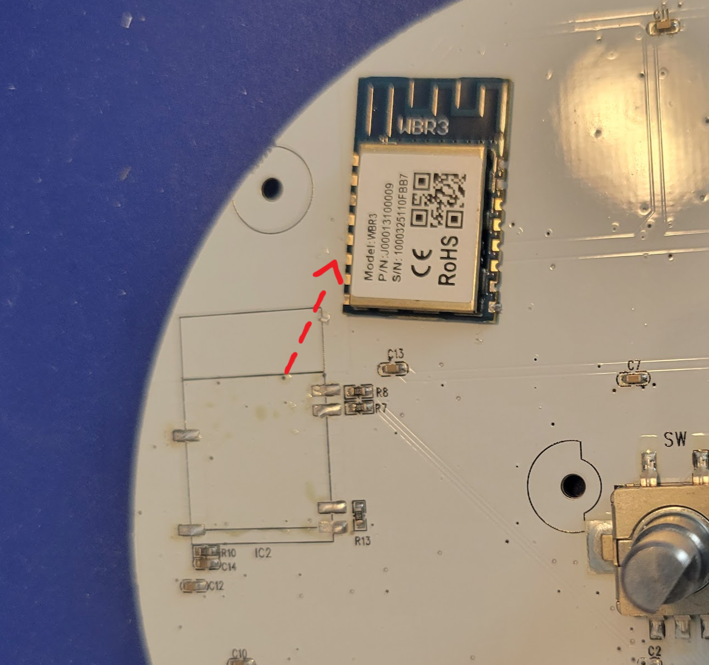

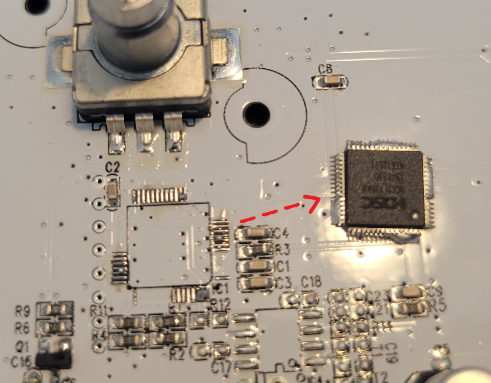

 

## Solder new stuff

Now we want to solder the needed jumpers and chip back on

    
ESP12F

Use some solder wick and clean up the pads where you pulled the WBR3 chip from, this will allow the ESP12F chip to sit flat on the PCB

Place the ESP12F on the board and solder it into place
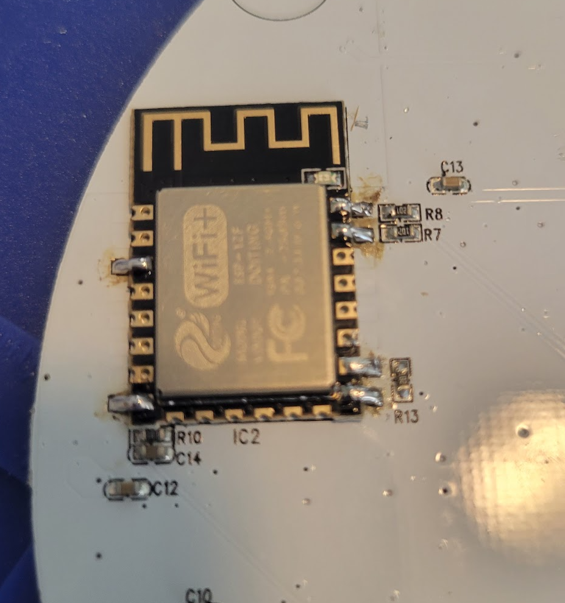

    
Data Pin Jumper

The secondary MCU used to drive the data pin of the LEDS.
We removed that chip and need to jump a wire from the where it connected to our ESP12F chip

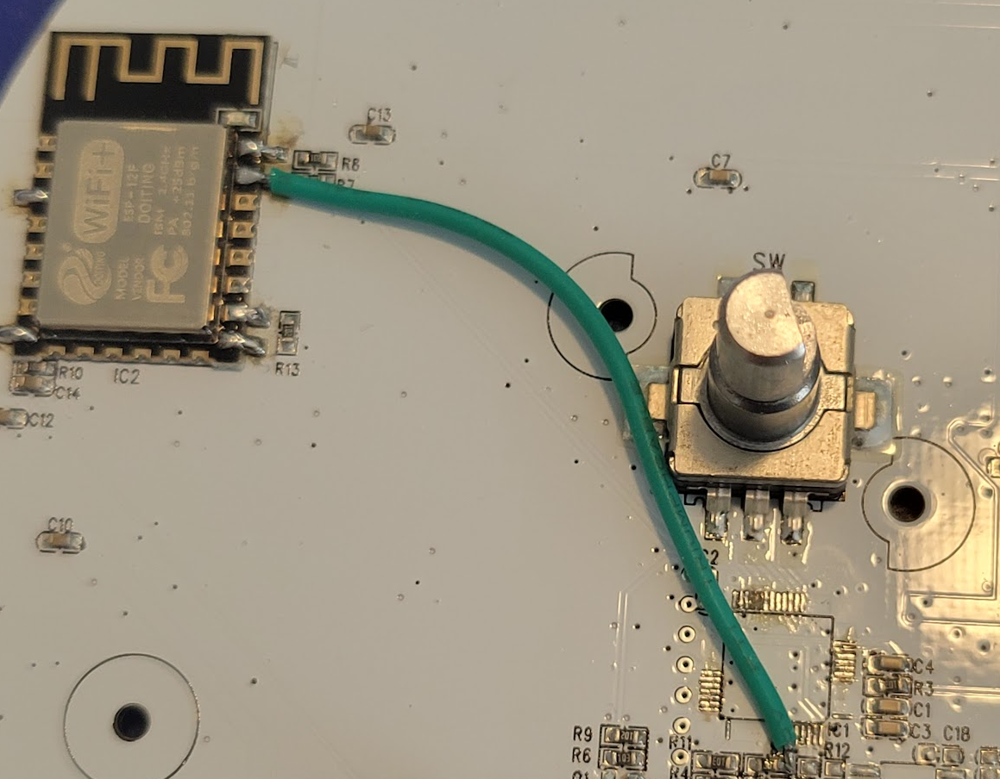

    
Ground Pin Jumper

With the secondary MCU removed we need to re-attach to the ground properly.
Take a small piece of wire and solder like shown here

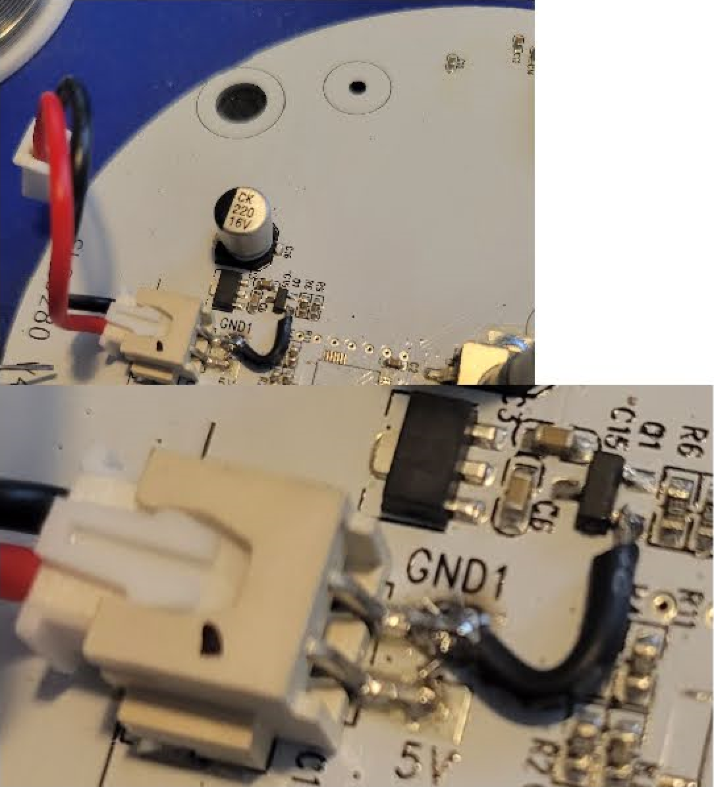

 

 `If you're not using the encoder you can stop here and re-assemble the unit and move on to the WLED settings section.`

 

    
Logic Level Shifter Board

Feel free to use any color wires you'd like.

| ESP12F |    LLC-LV | LLC-HV | Board Component |
|------ |-------------|-------------|-------------|
|VCC	| LV | HV | 5V
|Ground	| GND | GND | GND1
|GPIO12	| LV1 | HV1 | Encoder Pin 1
|GPIO13	| LV2 | HV2 | Encoder Pin 3
|GPIO14	| LV3 | HV3 | Encoder SW

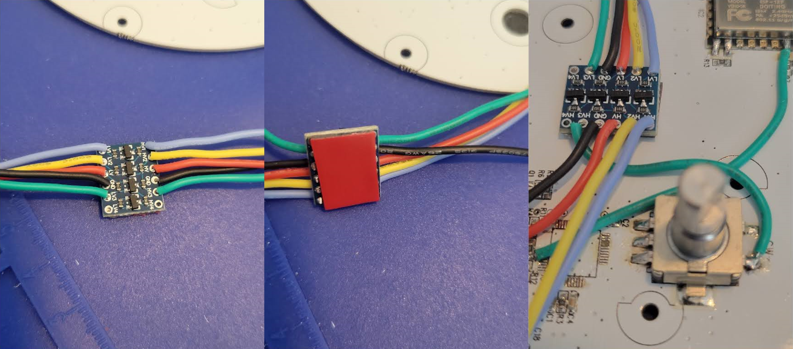

Adhere the board with some double sided adhesive

    
ESP12F to LLC Board

Wire up the 3.3V power and ground

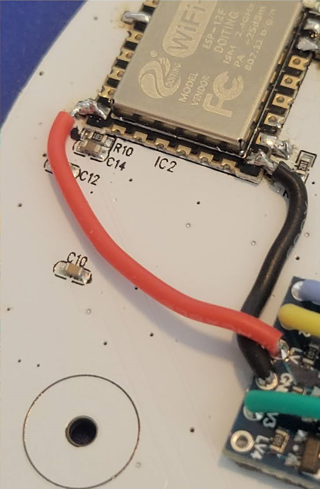

Here is a pic of the jumper wirings going to the ESP12F chip

    
Components to LLC Board

Wire up the 5V power and ground

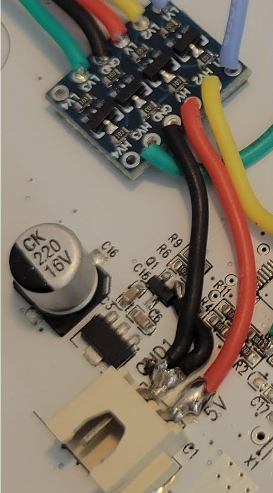

Here is a pic of the jumper wirings going to the ESP12F chip

 

## WLED Settings

    
General

| Location | Setting | Value | Description |
|---------|----------|-------|-------------|
| /settings/leds? | Maximum Current | 2500 mA | The power supply provided can do up to 2.5 amps |
| /settings/leds? | LED1 Type | WS281x | Main lamp LED type |
| /settings/leds? | LED1 Color Order | RGB | Main lamp LED color order |
| /settings/leds? | LED1 Length | 37 | Main lamp LED count on the face of the lamp |
| /settings/leds? | LED1 GPIO | 3 | Main lamp LED GPIO pin |
| /settings/leds? | LED2 Length | 1 | ESP12F single LED |
| /settings/leds? | LED2 GPIO | 2 | ESP12F single LED GPIO pin |
| /settings/leds? | LED2 Inverted | checked | ESP12F single LED turned off by default |
| /settings/leds? | Relay GPIO | -1 | Need to change this from the defaulf of 12 |

    
Encoder Usermod

This section is only needed if you've wired up the encoder as shown above

| Location | Name | Setting |
|----------|------|---------|
| /settings/um? | pin1 | 12 |
| /settings/um? | pin1 | 13 |
| /settings/um? | pin1 | 14 |

